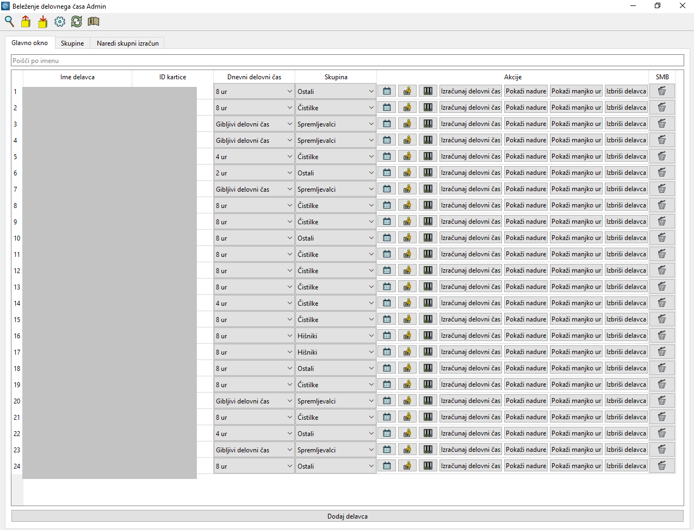
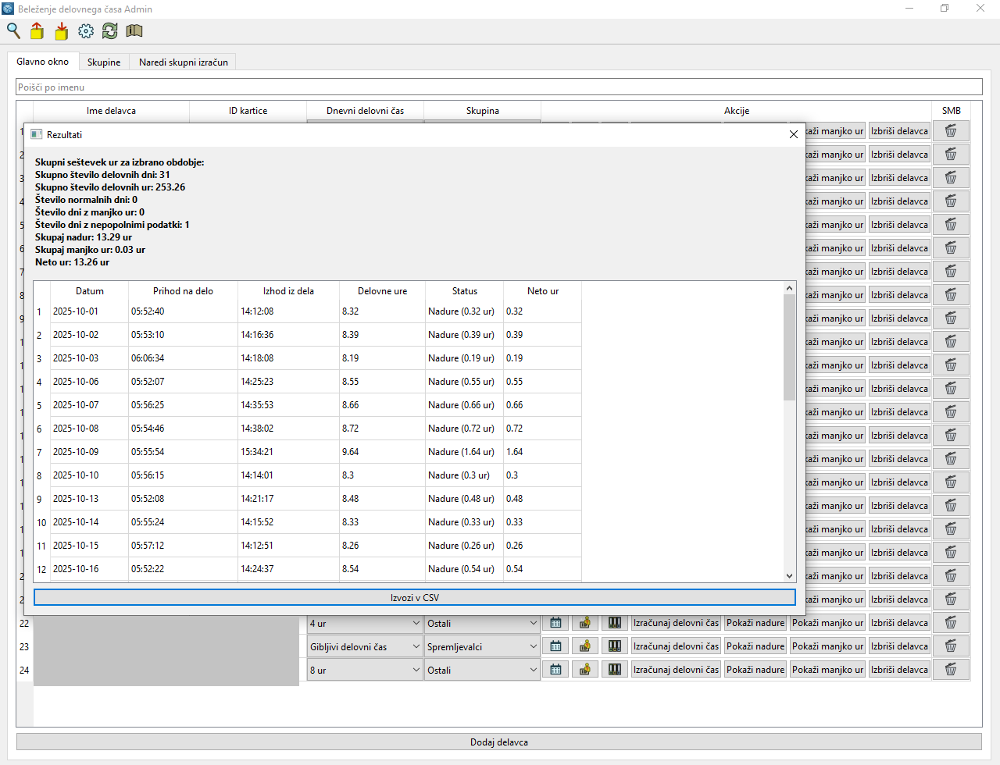

# Beleženje delovnega časa - Admin

Program za beleženje delovnega časa je bil narejen za beleženje delovnega časa zaposlenih na osnovni šoli z uporabo nfc ključkov ali kartic. Program je setavljen iz treh delov programske opreme + SMB shrambe + OneDrive (po potrebi, če se uporablja Aplikacija za zaposlene) , kjer se shranjujeo podatki. 

Beleženje delovnega časa admin je program za windows, ki ga uporablja administrator v šoli oz. podjetju za vpogled v delovni čas zaposlenih,izračunavanje skupnega delovnega časa, nadur, primankljaja, dodajanje dopusta, bolniškega staleža, dodajanje id-ja za nfc medij, urejanje skupin itd. Program črpa podatke iz SMB shrambe v mreži, tam shranjuje tudi konfiguracijo v json formatu, zato je možno več administartorjev na lokalnem omrežju. Porgram sproti sinhronizia podatke s SMB shrambo. 

Poleg program Beleženje delovnega časa admin za windows sta še:

-Androidna aplikacija »Ura« za »terminal« (androidna naprava na dotik) kamor se priklopi nfc čitalnik. Aplikacijo najdete v drugem repozitoriju uporabnika.

 -Androidna aplikacija za zaposlene črpa podatke iz OneDrive. To aplikacijo imajo zaposleni nameščeno na svojih telefonih za vpogled v delovni čas. Aplikacijo najdete v drugem repozitoriju uporabnika.

## Slike

